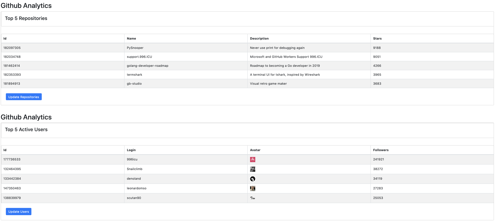

## Github Analytics
Github Analytics offers data analytics to view top github repositories and top github users.This app is created using Reactjs, Redux, Nodejs.
The site is hosted using Heroku (https://githubanalytics.herokuapp.com). 

## Getting Started.
To start this application on your application on your local system,
clone from this stash and follow the following instructions
1) npm install
2) npm start

The site will be by default hosted on port 8080 in the following url 
https://localhost:8080

## Future Enhancements
	- Fetching the list of Repositories based on user and events.

## Future Technical Improvement
    - Including Prop definition

    

